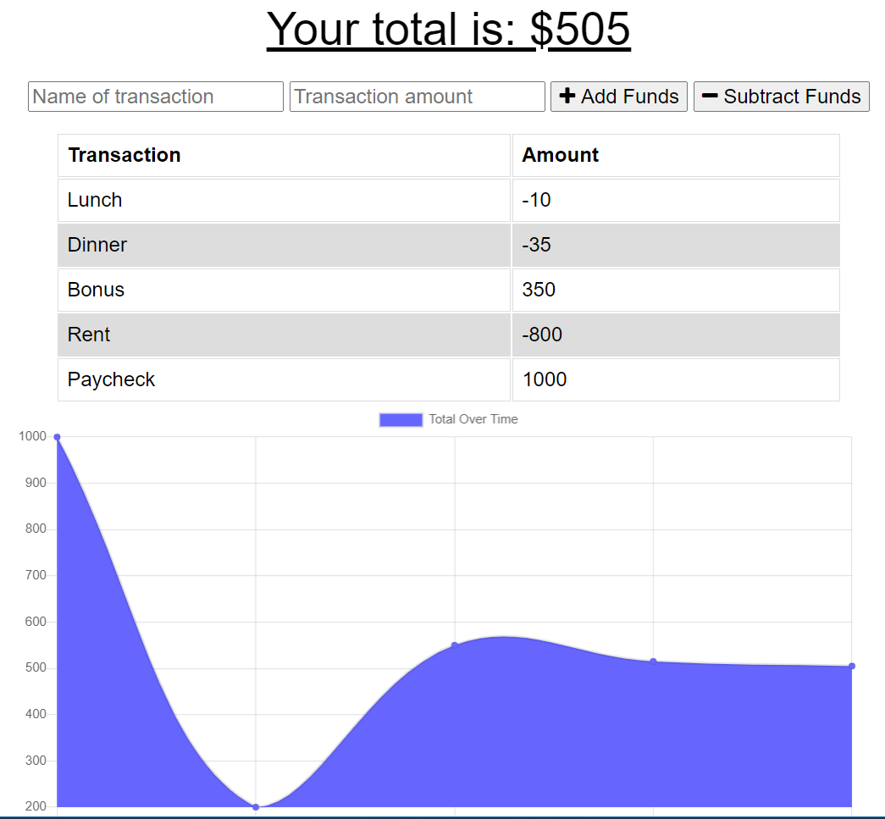

# Budget Tracker
[](https://opensource.org/licenses/MIT)

## Description
This is a budget tracker web app that has offline capability. This app allows a user to enter transactions on the web page. There is a list of transactions in a scrollable list with a graph displaying the transaction amounts below. This budget tracker app uses node.js, express, a service worker, manifest, and indexedDB which allows the app to work offline. When the site goes offline, the user is still able to view the page and enter transactions. The transactions are saved in the indexedDB, but once the site is back online, those transactions are pushed to the mongoDB and cleared from indexedDB.

## Table of contents
* [Installation](#installation)
* [License](#license)
* [Screenshots](#screenshots)
* [Tests](#tests)
* [Questions](#questions)
        
## Installation
To install necessary dependencies, run the following command:
```
npm i
```

## License 
This project is licensed under the MIT license.

## Screenshots



## Questions
If you have any questions about this repository, open an issue or contact me directly at megtej@gmail.com. You can find more of my work at [mslee001](https://github.com/mslee001).